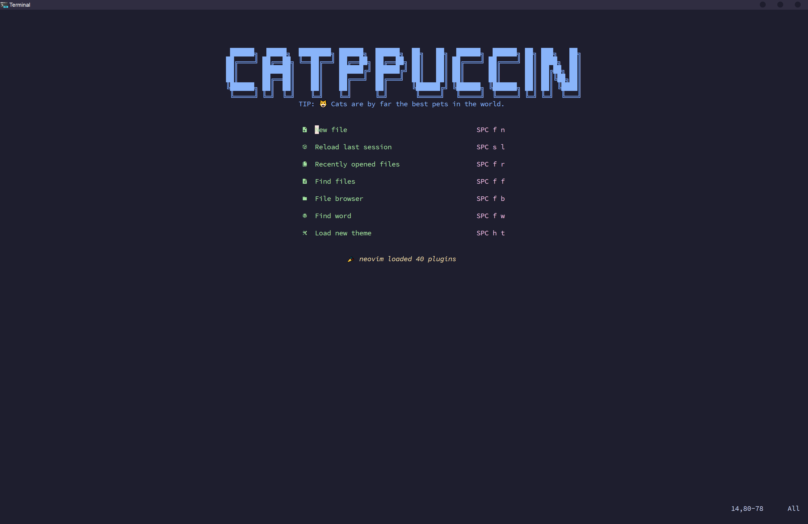
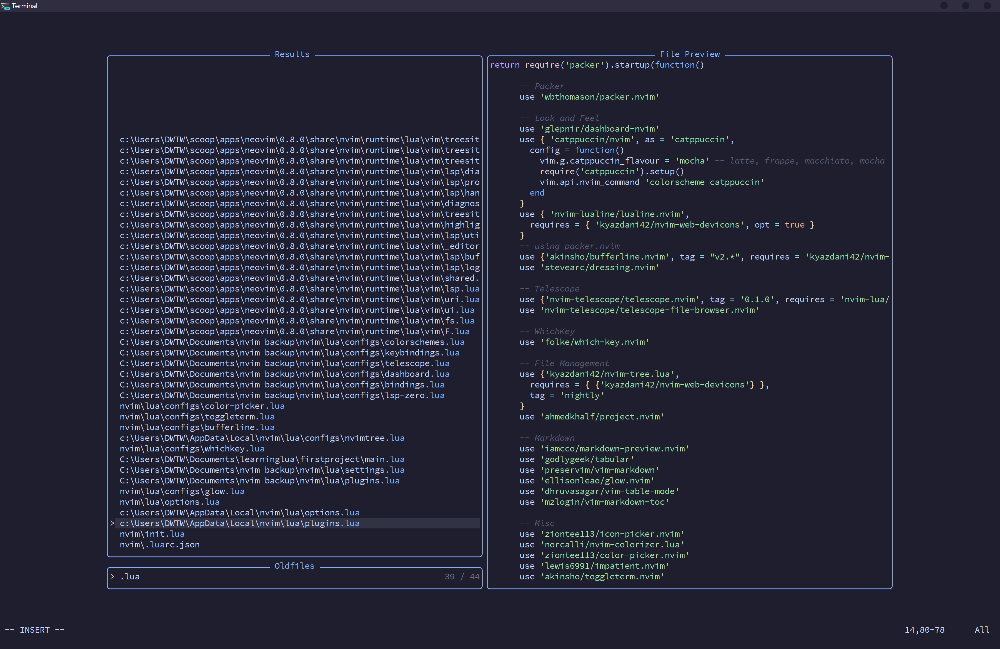
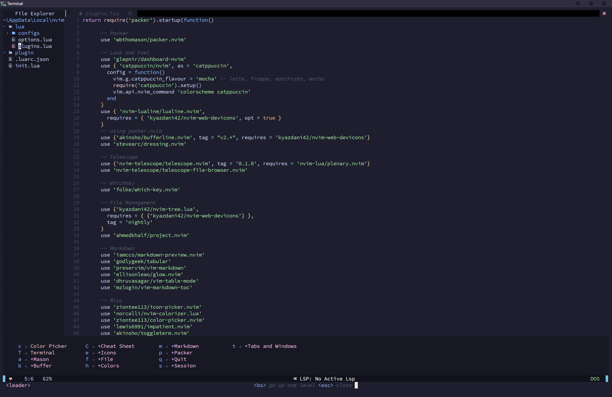

<br/>

<p align="center">
 
</p>


## Table Of Contents

- [About](#about)
- [Features](#features)
- [Screenshots](#screenshots)
- [Project Structure](#project-structure)
- [Documentation](#documentation)
- [Status](#status)
    - [Todo](#todo)


## About

NeoVim configuration for cat lovers ( _this is my personal NeoVim configuration_ ). So far it only contains configuration files, I plan to add an install script ( initially for Windows and then for Linux ) and better commented configuration files. I will also expand the README with installation instructions. The goal of this "project" is to give people who are new to NeoVim a place to start.

## Features

| Feature                         | Implemented |
|---------------------------------|-------------|
| Dashboard                       | ✅          |
| File Explorer & Fuzzy Finder    | ✅          |
| Word Finder                     | ✅          |
| Autocompletion and LSP Support* | ✅          |
| Auto cd into project directory  | ✅          |
| Various Markdown Plugins**      | ✅          |

There's much more (more detailed information about features and how to enable them coming soon)!


\* _Includes autodetection of current file and recommed LSP, lint or formatter installation to NeoVim's path using [LSP-Zero](https://github.com/VonHeikemen/lsp-zero.nvim) and [Mason](https://github.com/williamboman/mason.nvim)_

\** Markdown preview support in default browser (windows), easy creation on markdown tables, markdown preview within vim with [Glow](https://github.com/charmbracelet/glow) and easy generation of table of contents. As well as marksman for LSP support and ltex for linting.

## Screenshots





## Project Structure

```
    ├── init.lua                    / loading/sourcing configs
    ├── lua\                        / contains all of the sourced files
    │   ├── options.lua             / general neovim options 
    │   ├── plugins.lua             / all plugins that are intalled using packer
    │   └── configs\                / contains configurations for all plugins 
    └── plugin\                     / auto-created plugin folder
```

## Documentation

_Coming soon!_

## Status

This project is really early in its lifespan. There is a lot of cleaning up and improvement to be done.

### Todo

- Improve config so that it is easily reproducible on various computers and opereating systems and build an auto install script.
- Improve README and add documentation.
- Add useful comments to the config files.
- Make a website.
